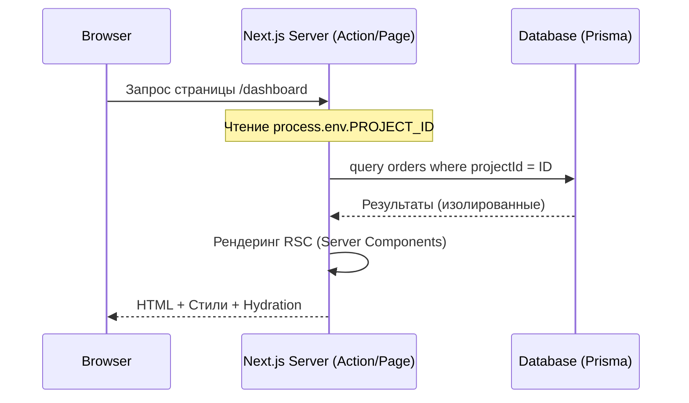

# Stitch Usage Patterns & Flow

Этот документ демонстрирует типичные сценарии использования методологии Stitch для разработки фронтенда Smmplan.

## 1. Компонентный Flow (The Stitching Process)

Разработка страницы всегда идет сверху вниз:
1.  **Data Layer (Server)**: Получение данных через Prisma с обязательной фильтрацией по `PROJECT_ID`.
2.  **Logic Layer (Server/Client Actions)**: Подготовка мутаций.
3.  **UI Layer (Stitched Components)**: Сборка интерфейса из готовых блоков.

### Диаграмма потока данных:


---

## 2. Шаблон Server Action

Все действия пользователя (напр. смена пароля) должны следовать этому паттерну:

```typescript
"use server";

import { auth } from "@/auth";
import { prisma } from "@/lib/prisma";
import { z } from "zod";

const Schema = z.object({
  newPassword: z.string().min(8),
});

export async function updatePassword(formData: FormData) {
  const session = await auth();
  if (!session?.user?.id) throw new Error("Unauthorized");

  const validated = Schema.parse({
    newPassword: formData.get("password"),
  });

  // ВАЖНО: Всегда проверяем принадлежность пользователя к проекту (если применимо)
  await prisma.user.update({
    where: { id: session.user.id },
    data: { password: validated.newPassword }
  });

  return { success: true };
}
```

---

## 3. Стилизация и Архетипы (Visual Archetypes)

Stitch позволяет радикально менять внешний вид сайта, сохраняя ту же архитектуру компонентов.

### Как переключать стили:
1.  **CSS Variables**: В `globals.css` определите базовые цвета (Background, Primary, Accent).
2.  **Tailwind Classes**: Используйте семантические классы в компонентах (напр. `bg-skin-base`, `text-skin-muted`).
3.  **Archetype Mapping**: В `implementation_plan.md` укажите, какой архетип используется (Dark Premium, Light Clean или Corporate).

### Сравнение анимаций:
- **Dark Premium**: Медленные, "плавающие" анимации (`duration: 0.8`), фокус на Blur и Opacity.
- **Light Clean**: Быстрые, "пружинистые" анимации (`type: "spring"`), фокус на масштабе (`scale`).
- **Corporate**: Минимальные переходы (`duration: 0.2`), фокус на четком появлении (`y: 0`).
