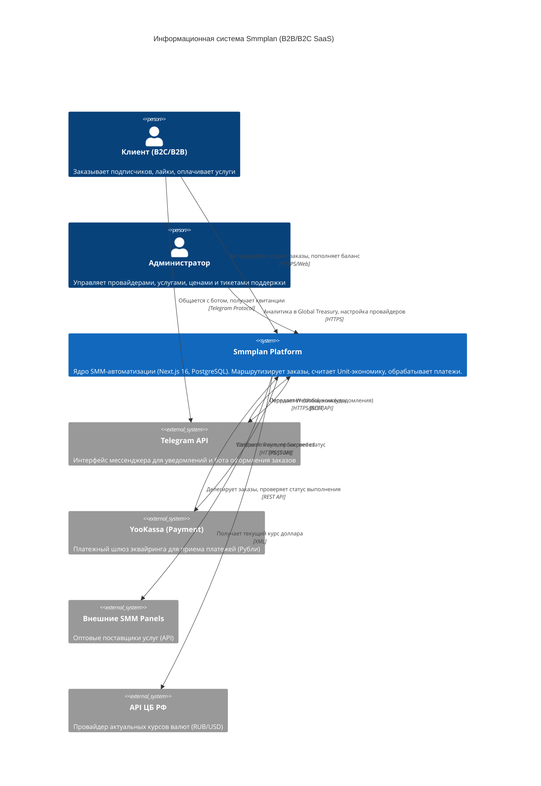

# 🏛 Архитектура: Контекст Системы (System Context)

В архитектуре **Smmplan** (построенной на базе концепции C4 Model) контекстный уровень (Layer 1) показывает, как платформа взаимодействует с внешними агентами (пользователями, администраторами) и внешними системами.

## C4 Диаграмма: Контекст (Mermaid.js)

## Участники (Actors)

1. **Клиент (Customer):** Конечный пользователь. Заходит через браузер или `Telegram-бот`. Ему важны скорость загрузки, микро-анимации и Trust-сигналы при оплате (см. Neuro-UX Design).
2. **Администратор (Admin):** Управляет бизнесом: подключает провайдеров, меняет наценки (Markup) и обрабатывает тикеты HappinessDesk. 

## Внешние Системы (External Systems)

Сложность Smmplan заключается в его роли "Маршрутизатора" между деньгами (YooKassa/Crypto) и Исполнителями (Оптовые SMM-панели).
Мы никогда не исполняем услуги самостоятельно. Мы — *финансовый кэширующий слой и агрегатор B2B/B2C заявок*.
