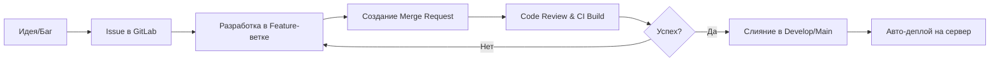

# 🎯 Smmplan Team Strategy: От Хаоса к Масштабируемости

---

## 🏗️ Наш Технологический Фундамент: Почему именно ЭТО?

### 1. Docker: Наш "Контейнер Стабильности"
**Причина (Why):** Если проект работает у одного разработчика, он должен работать везде.
**Следствие (Effect):**
- Мы изолируем базу данных, сайт и бота. 
- Одна ошибка в боте не "уронит" сайт.
- На сервере с 4GB RAM Docker позволяет жестко ограничить ресурсы каждого модуля, чтобы система не "захлебнулась".

### 2. GitLab: Наш "Центр Управления Полетами"
**Причина (Why):** Нам нужно единое место, где лежит код, ставятся задачи и проверяется качество.
**Следствие (Effect):**
- История изменений (Git) позволяет откатиться назад, если что-то сломалось.
- Issues (Задачи) делают работу прозрачной: никто не спрашивает "чем ты занят?".

---

## 🔄 Жизненный Цикл Задачи (Workflow)

### Причинно-следственная связь этого процесса:
1. **Создание ветки** => Код защищен от случайных правок в "боевой" версии.
2. **Merge Request** => Минимум двое глаз видят код перед тем, как он попадет к клиенту.
3. **CI Build (Авто-сборка)** => Устраняется "человеческий фактор" при деплое.

---

## 💎 Культура Качества: "Zero Error Policy"

Мы не просто пишем код, мы создаем сложный финансовый инструмент.

| Действие | Почему это важно? (Причина) | Результат (Следствие) |
| :--- | :--- | :--- |
| **Code Review** | Обмен знаниями внутри команды. | Нет "уникальных" специалистов, любой может подменить любого. |
| **Weight (Веса)** | Мы учимся оценивать свои силы. | Сроки перестают "гореть", планирование становится точным. |
| **Unit Tests** | Автоматическая проверка логики. | Мы уверены, что новые функции не сломали старые. |

---

## 📈 Последовательность Роста

1.  **Stage 1 (Сейчас)**: Настройка GitLab, перенос кода, понимание Git Flow.
2.  **Stage 2**: Описание всех текущих багов в Issues, расстановка приоритетов.
3.  **Stage 3**: Полная автоматизация (CI/CD) — забываем про WinSCP навсегда.

---

**Smmplan — это продукт, который должен работать идеально. Наш процесс — это единственный способ этого достичь.**
